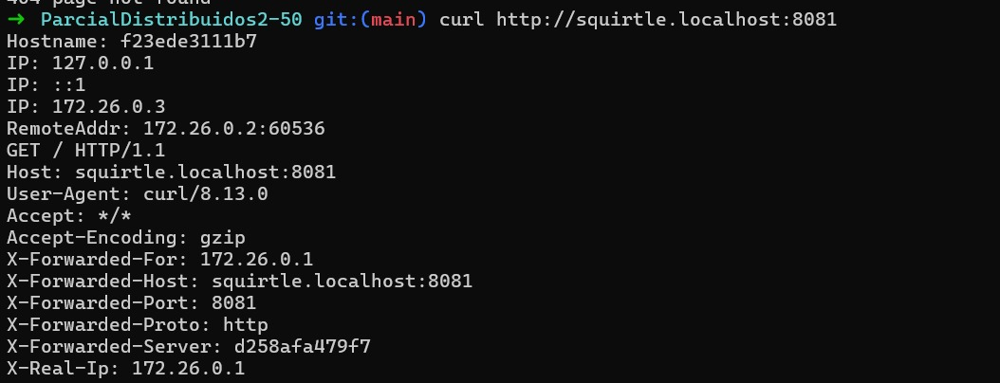
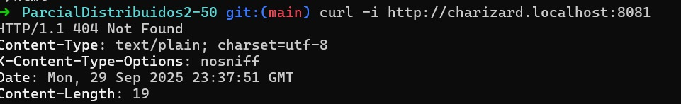
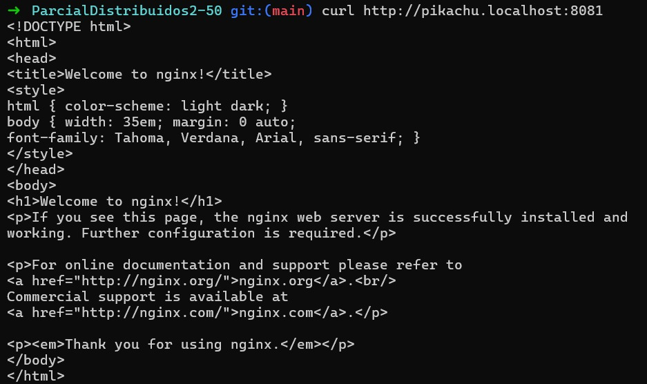
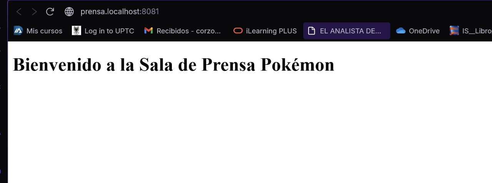

# PARTICIPANTES
David Fernando Cifuentes Bohosquez - 202221101
Alec Fabian Corzo Salazar - 202220646

# PRIMER PUNTO

Squirtle

Charizard neo4h

pikachu api

# TERCER PUNTO
En el aeropuerto cada middleware representa un control de seguridad que deben pasar los pasajeros en este casp:

### BasicAuth
  Funciona como la parte del control de pasaportes, ya que solo quienes presenten credenciales válidas pueden acceder a la sala  
  
### RateLimit 
  Es como el torniquete que regula el flujo de pasajeros, permitiendo solo cierto número de personas por minuto para evitar congestión en la puerta de embarque 

## REFLEXIÓN
Nuestro aeropuerto Pokémon de la region de Kanto, refleja transparencia al mostrar claramente qué servicios son públicos administrados por Amarouge,  y cuáles internos que los administra Ceruledge. Rillaboom, y Arcanine se encargan  de la escalabilidad haciendo uso de Traefik el cual  balanceando cargas entre las replicas, y Mr. Mime, se apoya de Growlite, para buscar la meayor  tolerancia a los fallos ya que cubre los servicios cri  ticos que se pueden desplegar en diferentes instancias, además de poderse mantener disponible en caso de que alguna instancia llegue a caer.

# CUARTO PUNTO

